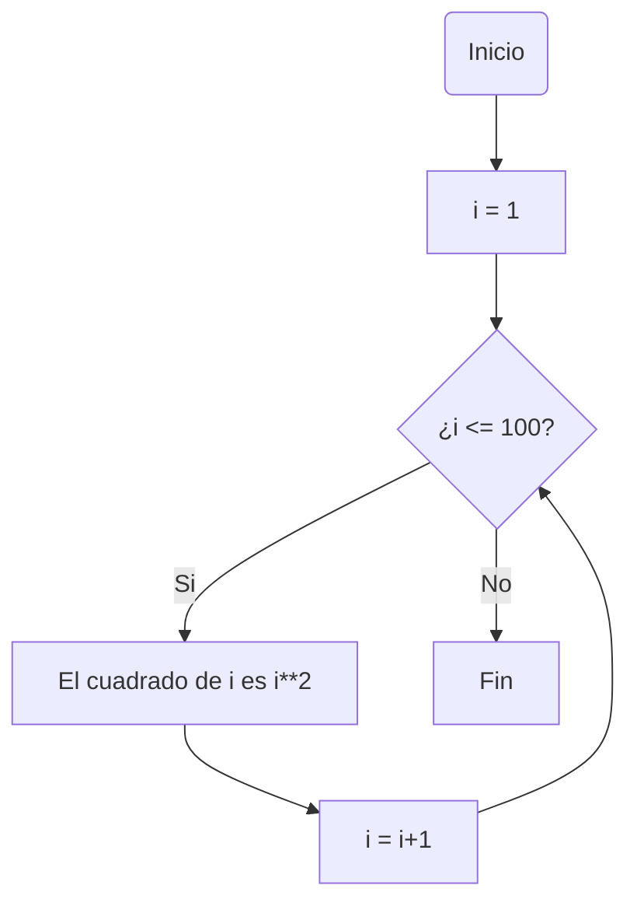
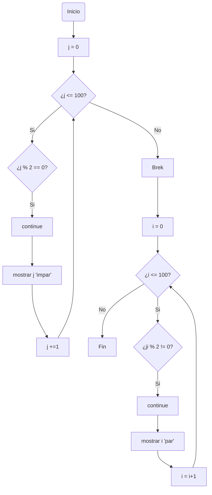
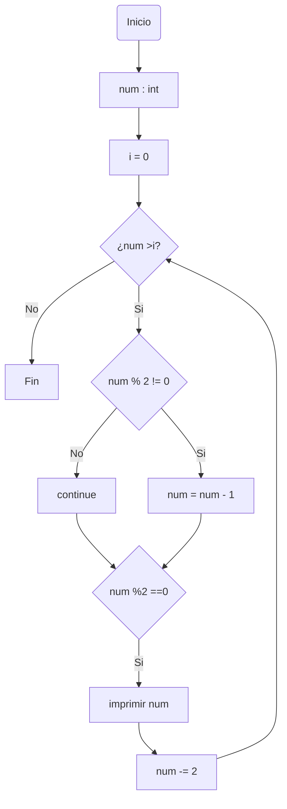

# Reto_7
### Primer punto
Imprimir un listado con los números del 1 al 100 cada uno con su respectivo cuadrado.
```
i : int = 1 #Se inicializa i en 1, ya que va desde 1
while (i <= 100 ): #Entra en el ciclo siempre y cuando i sea menor o igual a 100
    print (f"El cuadrado de {i} es: {i**2}") #Se imprime la variable con su cuadrado
    i += 1 # Se actualiza el valor de i sumando 1 en cada iteracion 
```
Diagrama de Flujo

### Segundo punto
Imprimir un listado con los números impares desde 1 hasta 999 y seguidamente otro listado con los números pares desde 2 hasta 1000.
```
j : int = 0 # Se inicializa la varible j que se va a encargar de cambiar en el ciclo While
print ("La lista de los numeros impares del 1 hasta el 1000 es:") # Se imprime un mensaje
while(j < 1000): # j entra en el ciclo While y este se repite siempre que j sea menor a 1000
  if (j % 2 == 0): #Se utiliza un condicional en el cual se evalua si modulo de j entre 2 es igual a cero, si esto es verdad es un numero para
    continue #Si esto es verdad, sale de la iteracion actual y continua con el ciclo
  print (j)#Se imprime j, que vendria siendo un numero impar
  j += 1 # La variable j se actualiza

i : int = 0 
print ("La lista de los numeros pares del 1 hasta el 1000 es:")
while(i < 1000): 
  i += 1 
  if (i % 2 != 0): #Se evalua si el modula entre i y 2 es diferente a 0, si es verdad significa que es un numero impar
    continue # Ya que es un numero impar sale de la iteracion y continua con el ciclo
  print (i)
  i += 1
```
Diagrama de Flujo

### Tercer punto
Imprimir los números pares en forma descendente hasta 2 que son menores o iguales a un número natural n ≥ 2 dado
```
num : int
num = int (input("Ingrese un numero natural: ")) #Se solicita un numero al usuario
i : int = 0 # Se inicializa una variable que sera el iterador 
while (num > i): #Se implementa el ciclo While, el cual se repetira siempre y cuando el numero ingresado sea mayor al iterador (i)
    if (num % 2 != 0 ): #Si aplica un condicion para evaluar si el numero es impar
        num = num - 1 #Si es impar se el resta uno para que quede un numero par
    if (num % 2 == 0): # Se verifica que cada numero sea par
        print (num) #Se imprime el numero par
    num -= 2 #El iterador debe ir cambiando restando 2, para se impriman los numero hasta 2 y no hasta 0
```
Diagrama de Flujo

### Cuarto punto
En 2022 el país A tendrá una población de 25 millones de habitantes y el país B de 18.9 millones. Las tasas de crecimiento anual de la población serán de 2% y 3% respectivamente. Desarrollar un algoritmo para informar en que año la población del país B superará a la de A.
```
año : int; pais_a : float; pais_b : float # Se declaran las variables que se van a utilizar
año = 2022 #Se inicializan las varibles que nos dan
pais_a = 25000000
pais_b = 18900000
while (pais_a > pais_b): # El ciclo se repite hasta que el numero de habitantes del pais B sea mayor al pais A
    pais_a += (pais_a*0.02)  #En cada iteracion la poblacion crece un porcentaje
    pais_b += (pais_b*0.03)
    año +=1   #Se actualiza el año en cada iteracion
print (f"El año donde la poblacion del pais B superara a la del pais A es en el año: {año + 1}") 
"""
En el año 2051 la poblacion del pais A aun sera mayor a la del pais B. por lo cual en el 2052 la poblacion sera mayor en el año siguiente, es decir en el 2052
"""
```
### Quinto punto
Imprimir el factorial de un número natural n dado.
```
num : int; fac : int, i: int #Se declaran las variables a utilizar
num = int (input ("¿A que numero le quiere sacar el factorial?: ")) # Se le pide un numero al usuario
i : int = 1 #Se incializan las variables
fac : int = 1
while (i<=num): #El ciclo While se repite siempre que el iterador (i) sea menor al numero ingresado
    fac *= i # Se actuliza el valor de fac, multiplicando todos lo numero anteriores a este
    i+=1 #Se actualiza el iterador
print (f"El numero factorial de {num} es {fac}") #Se imprime el resultador
```
### Sexto punto
Implementar un algoritmo que permita adivinar un número dado de 1 a 100, preguntando en cada caso si el número es mayor, menor o igual.
```
import random  #Se importa la libreria random para que el python genere un elemento al asar en un rango establecido

num_aleatorio : int; num_2 : int; oportunidad : int = 0 # Se declaran e incializan las variables
num_aleatorio = random.randrange (1,100) # devuelve un elemento aleatorio extraído de la secuencia de números enteros generada por range
num_1 = int ( input ("Ingrese el numero: ")) # Permite ingresar un numero para intentar adivinar el numero
while ( num_aleatorio != num_1): #El ciclo se repite siempre que el numero aleatorio sea diferente al numero ingresado
    if (num_aleatorio > num_1): # Se implementa un incondicional para evaluar si el numero ingresado es mayor o menor al numero aleatorio
        print ( "El numero a adivinar es  mayor")
        num_1 = int ( input ("Ingrese nuevamente un otro numero: "))
    else:
        print ( "El numero a adivinar es  menor")
        num_1 = int ( input ("Ingrese nuevamente otro el numero: ")) #Se muestran los mensajes correspondientes
    oportunidad += 1 #Se actualiza el numero de intentos que se ha hecho
print (f"Excelente, Has adivinado el numero que era {num_aleatorio} en {oportunidad} oportunidades")
```
### Séptimo punto
Implementar un programa que ingrese un número de 2 a 50 y muestre sus divisores.
```
num : int
num = int (input ("Ingrese  a que numero quiere sacar los divisores: ")) #Se pide un numero al usuario
i : int = 1 # Se inializa el iterador del ciclo
print (f"los divisores de {num} son: ")
while (num > i): # El ciclo While se repite siempre cuando i sea menor al numero
    if (num % i == 0): # Se implementa un condicional, en el cual se evalua el numero por todos lo numero anteriores
        print (i) # Si esto se cumple, indica que si es divisor y este se imprime
    i +=1 # Se actualiza la variable
    
```
### Octavo punto
Implementar el algoritmo que muestre los números primos del 1 al 100. Nota: use funciones
```
#Se crea una funcion para verificar si un numerp es primo o no
def evaluar_numero (num : int, i : int = 2 ): #i Se inicializa en 2, para que pueda entrar al ciclo While
    while (i <= (num**1/2)): #se implementa el ciclo While, se repite siempre y cuando i sea menor o igual a la raiz del numero
        if (num % i == 0): #Se aplica un condicional, donde retorna False si el modulo entre el numero y i es igual a cero
            return False
        i +=1 #Se actuliza la variable i aumentando 1 cada vez que pasa por el ciclo
    return True #Retorna True cuando el numero es primo

num : int = 0 #Se inicializa la variable num en 1 para estar seguros que entre en el ciclo While, y que empiece desde 1
if __name__ == "__main__": #funcion principal
    while (num <= 100): #Este ciclo while se repite siempre y cuando num sea menor o igual a 100
        if (evaluar_numero(num) == True): # Se implementa la funcion evaluar_numero para verificar cada numero del 1 al 100
            print (num)#Si la funcion es igual a True se imprime el numero primo.
            num +=1 #Se actualiza la variable num sumando 1
        else: #Si la funcion no es igual a True simplementeo se le actualiza num, sumando 1
            num +=1

```
